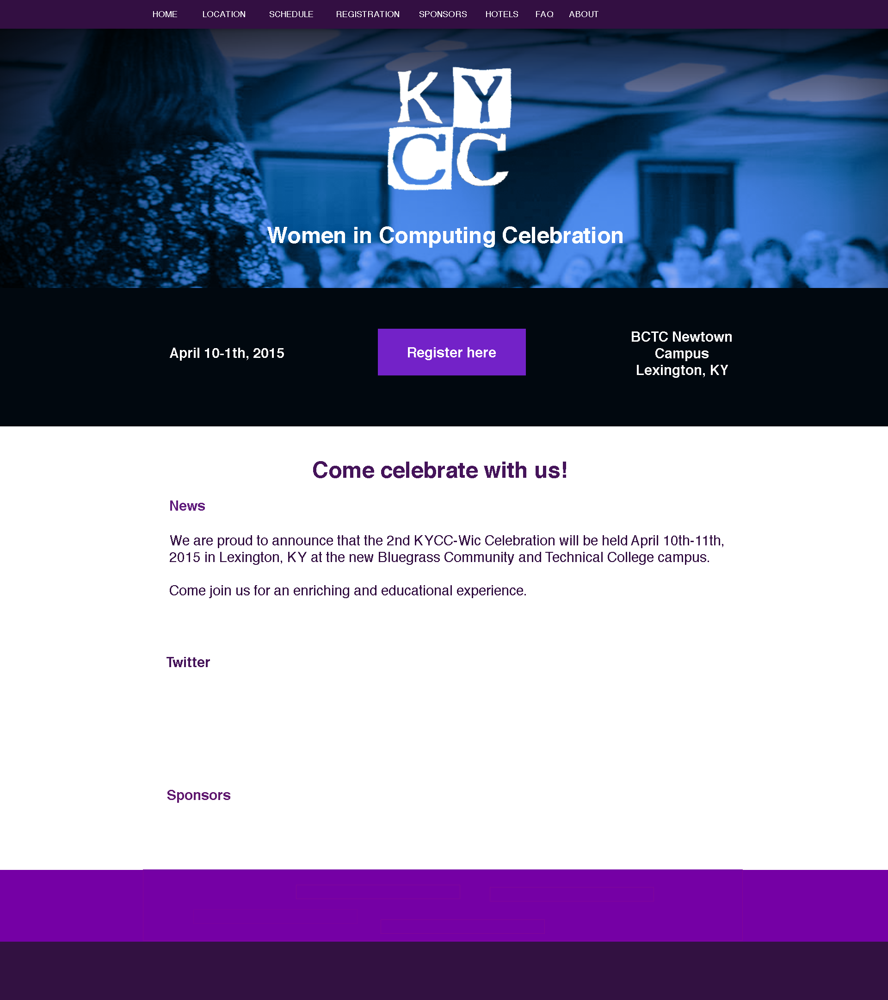

# KYCC-WIC

Women in Computing Conference Website

## How to Run

    bundle
    bundle exec jekyll serve -w

View in [http://localhost:4000](http://localhost:4000). Using `jekyll serve -w` will watch for changes and update the site without having to restart the server, only reloading the browser.

## The Design

## Colors

Dark Purple [#45145a]

Electric Purple [#7500a5]

Light Purple [#7322c8]

Dark Blue [#3860e0]

Light Blue [#5bacee]
